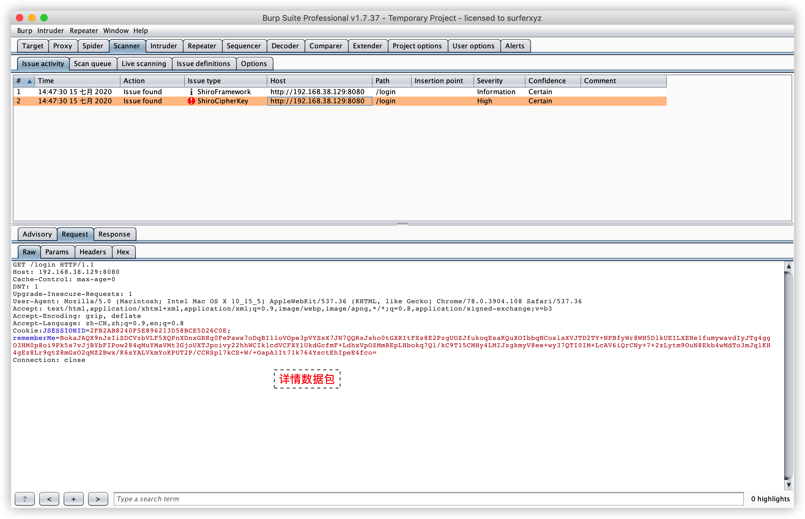
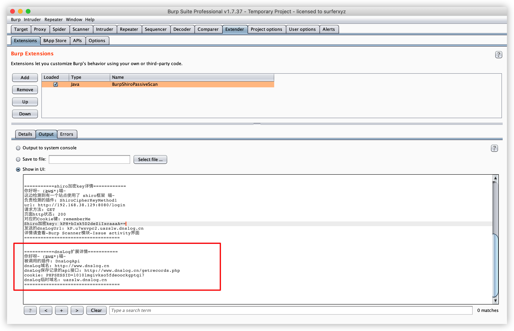
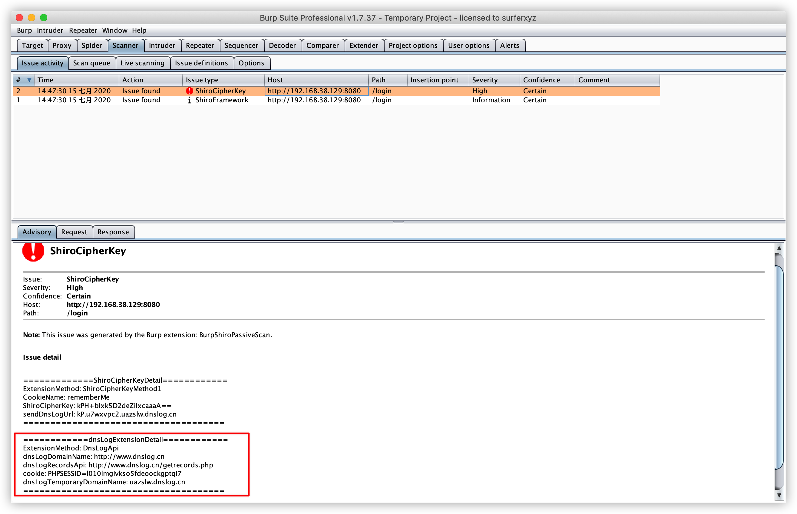
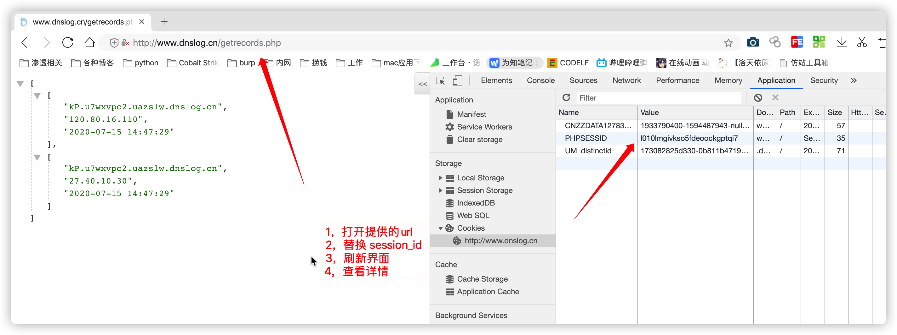
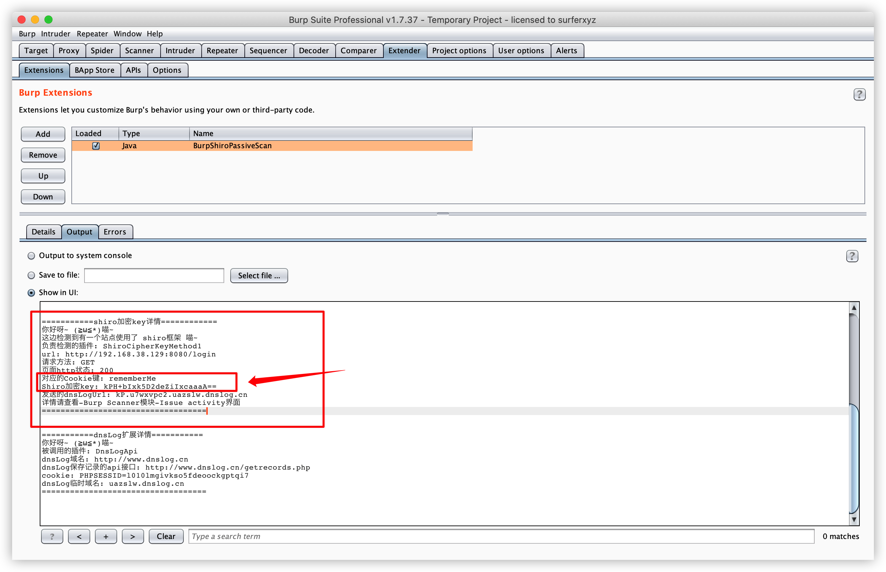
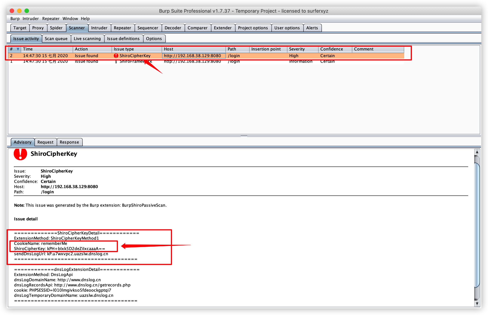

# BurpShiroPassiveScan
一款基于BurpSuite的被动式shiro检测插件

# 自言自语
据听说它的诞生是因为作者太太太懒了!

不想每个站点自己去添加个rememberMe去探测是否shiro框架

于是乎～

它就诞生了

# 简介
BurpShiroPassiveScan 一个希望能节省一些渗透时间好进行划水的扫描插件

该插件会对BurpSuite传进来的每个不同的域名+端口的流量进行一次shiro检测

目前的功能如下
- shiro框架指纹检测
- shiro加密key检测

# 安装方法
这是一个 java maven项目

如果你想自己编译的话, 那就下载本源码自己编译成 jar包 然后进行导入BurpSuite

如果不想自己编译, 那么下载该项目提供的 jar包 进行导入即可

# 使用方法
例如我们正常访问网站

访问完毕以后, 插件就会自动去进行扫描

如果有结果那么插件就会在以下地方显示
- Extender
- Scanner-Issue activity

# 问题查看

# dnslog详情方法查看
如果想看插件发了什么dnslog详情可以查看这里

# shiro加密key查看

