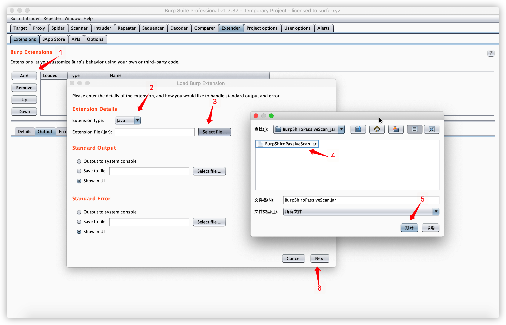
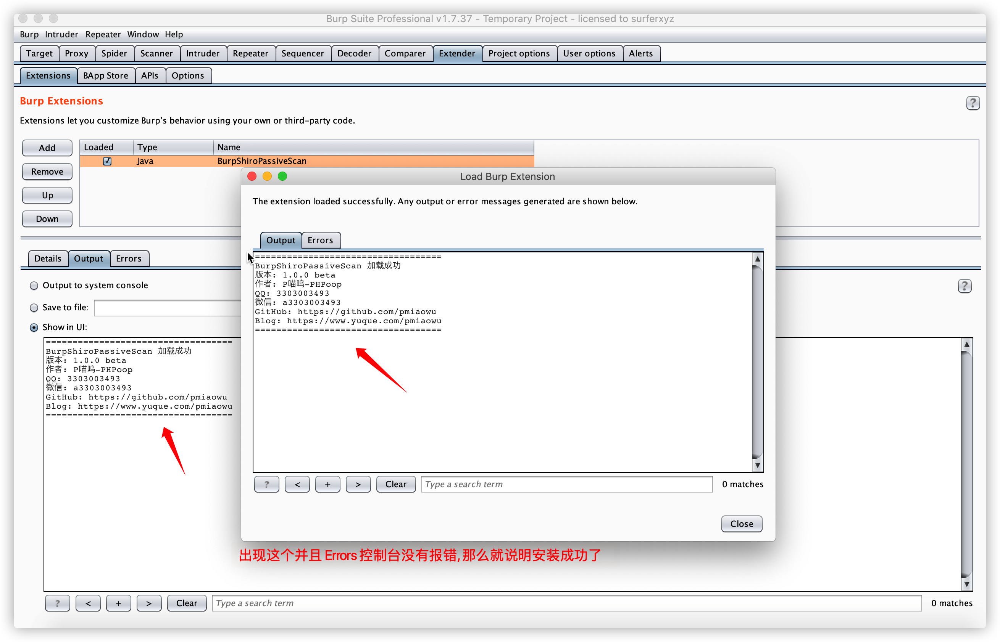
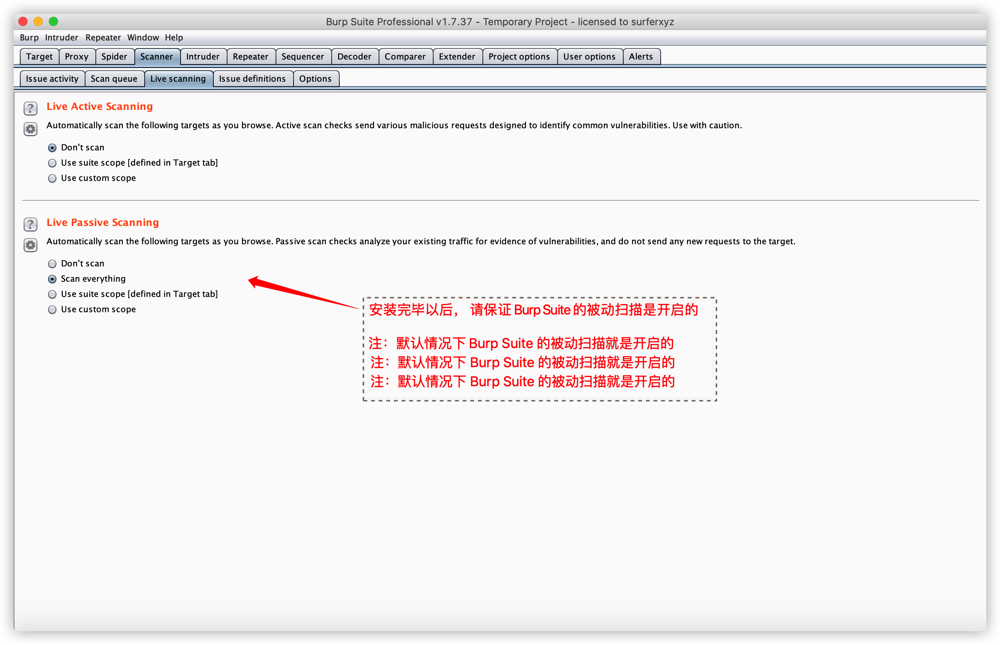
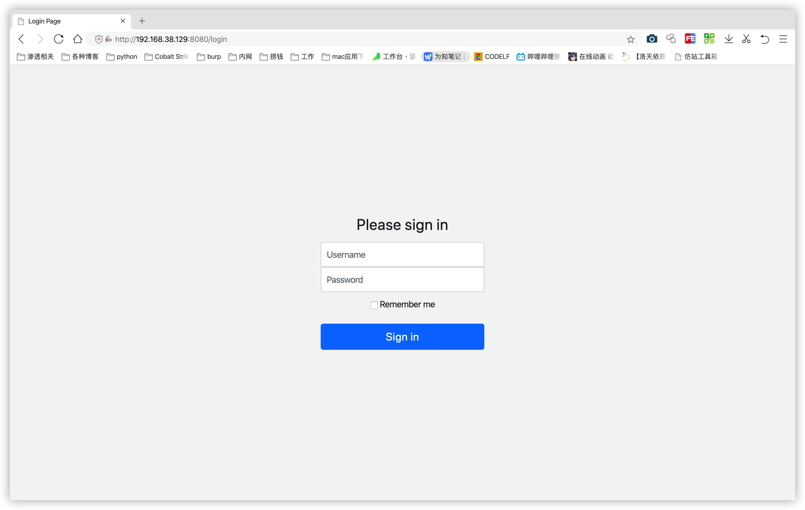
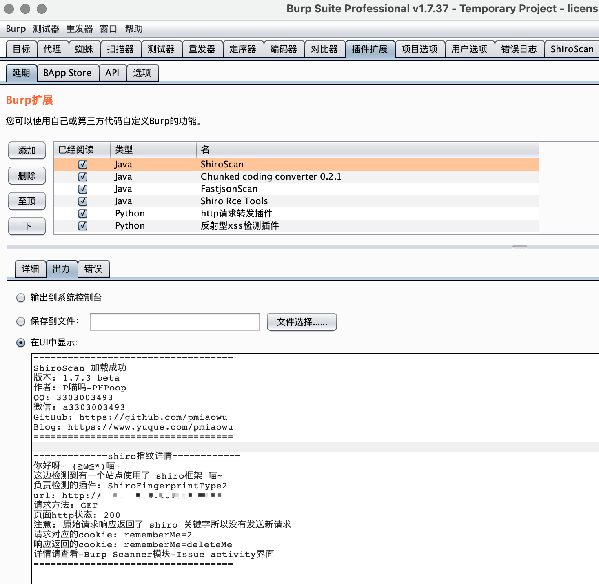
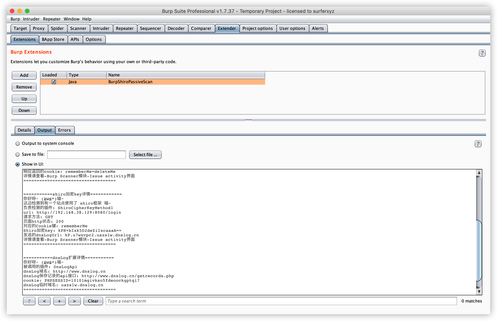
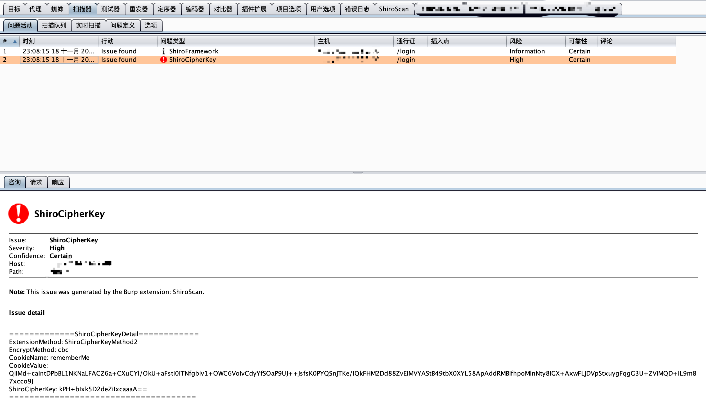
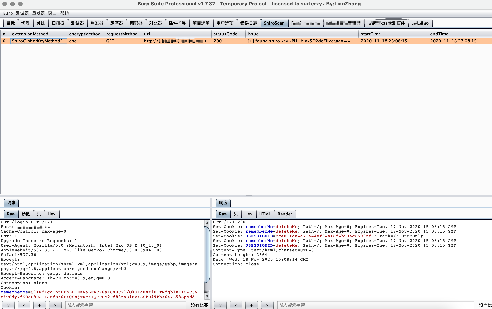

# BurpShiroPassiveScan
一款基于BurpSuite的被动式shiro检测插件

# 免责声明
该工具仅用于安全自查检测

由于传播、利用此工具所提供的信息而造成的任何直接或者间接的后果及损失，均由使用者本人负责，作者不为此承担任何责任。

本人拥有对此工具的修改和解释权。未经网络安全部门及相关部门允许，不得善自使用本工具进行任何攻击活动，不得以任何方式将其用于商业目的。

# 自言自语
据听说它的诞生是因为作者太太太懒了!

不想每个站点自己去添加个rememberMe去探测是否shiro框架

于是乎～

它就诞生了

# 简介
BurpShiroPassiveScan 一个希望能节省一些渗透时间好进行划水的扫描插件

该插件会对BurpSuite传进来的每个不同的域名+端口的流量进行一次shiro检测

目前的功能如下
- shiro框架指纹检测
- shiro加密key检测

# 安装方法
这是一个 java maven项目

如果你想自己编译的话, 那就下载本源码自己编译成 jar包 然后进行导入BurpSuite

如果不想自己编译, 那么下载该项目提供的 jar包 进行导入即可

# 检测方法选择

目前有一种方法进行 shiro框架 key的检测

1. l1nk3r师傅 的 基于原生shiro框架 检测方法

l1nk3r师傅的检测思路地址: https://mp.weixin.qq.com/s/do88_4Td1CSeKLmFqhGCuQ

目前这两种方法都已经实现！！！

根据我的测试 l1nk3r师傅 的更加适合用来检测“shiro key”这个功能！！！

使用 l1nk3r师傅 这个方法 对比 URLDNS 我认为有以下优点

1. 去掉了请求dnslog的时间, 提高了扫描速度, 减少了大量的额外请求
2. 避免了有的站点没有 dnslog 导致漏报
3. 生成的密文更短, 不容易被waf拦截

基于以上优点, 我决定了, 现在默认使用 l1nk3r师傅 这个方法进行 shiro key的爆破

# 使用方法
例如我们正常访问网站

访问完毕以后, 插件就会自动去进行扫描

如果有结果那么插件就会在以下地方显示
- Extender
- Scanner-Issue activity

# 问题查看

# shiro加密key查看

# shiro加密方法
目前搭配了两种加密方法 cbc 与 gcm 

cbc就是经常使用的

gcm就是最新出的

# tag界面查看漏洞情况

现在可以通过tag界面查看漏洞情况了

分别会返回

- waiting for test results = 扫描shiro key 中
- shiro key scan out of memory error = 扫描shiro key时,发生内存错误
- shiro key scan diff page too many errors = 扫描shiro key时,页面之间的相似度比对失败太多
- shiro key scan task timeout = 扫描shiro key时,任务执行超时
- shiro key scan unknown error = 扫描shiro key时,发生未知错误
- [-] not found shiro key = 没有扫描出 shiro key
- [+] found shiro key: xxxxxx = 扫描出了 shiro key

注意: 发生异常错误的时候,不用担心下次不会扫描了,下次访问该站点的时候依然会尝试进行shiro key扫描,直到扫描完毕为止