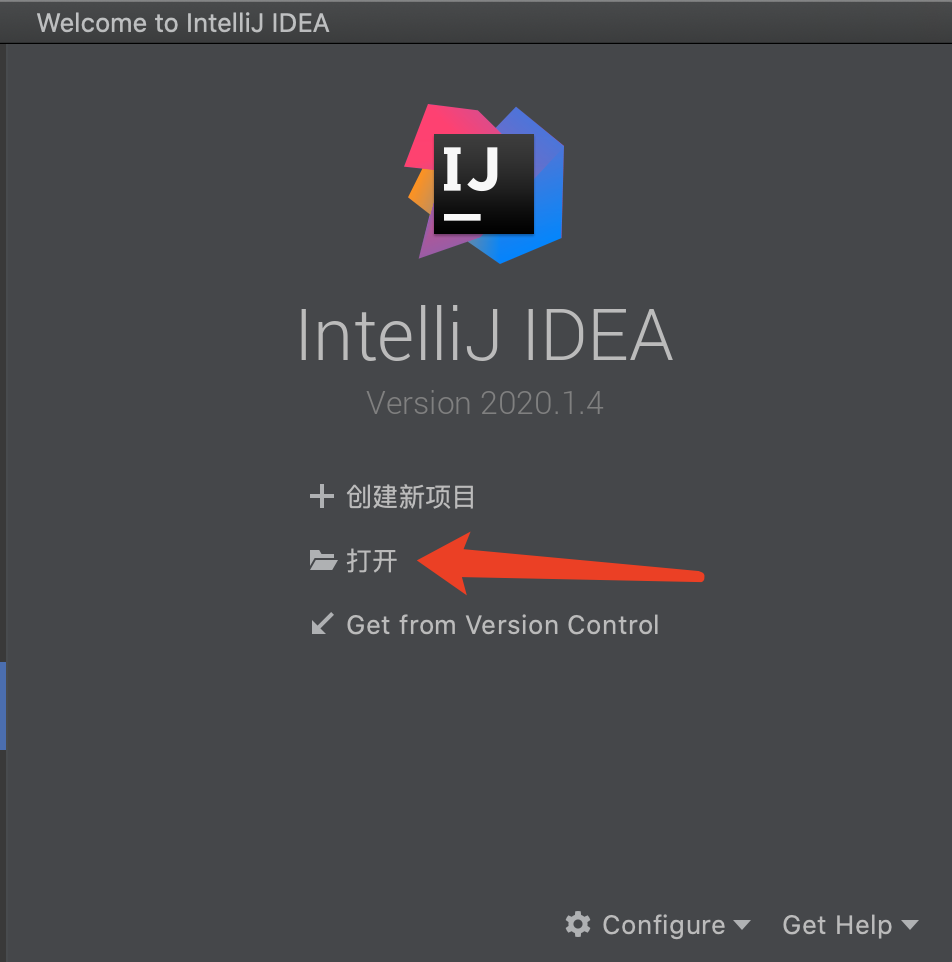
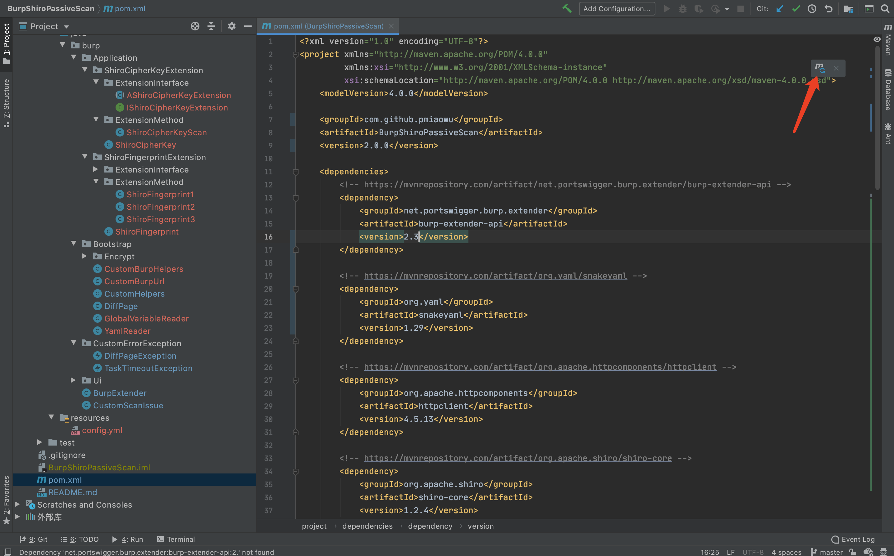
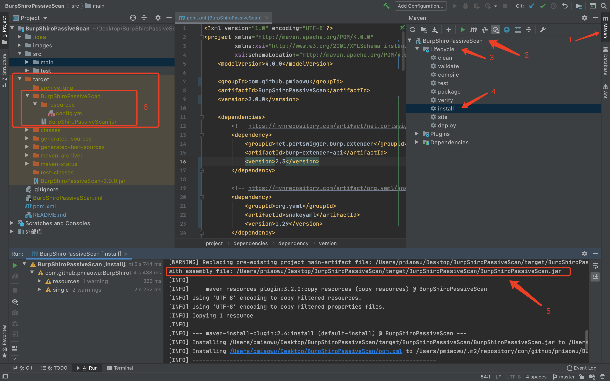
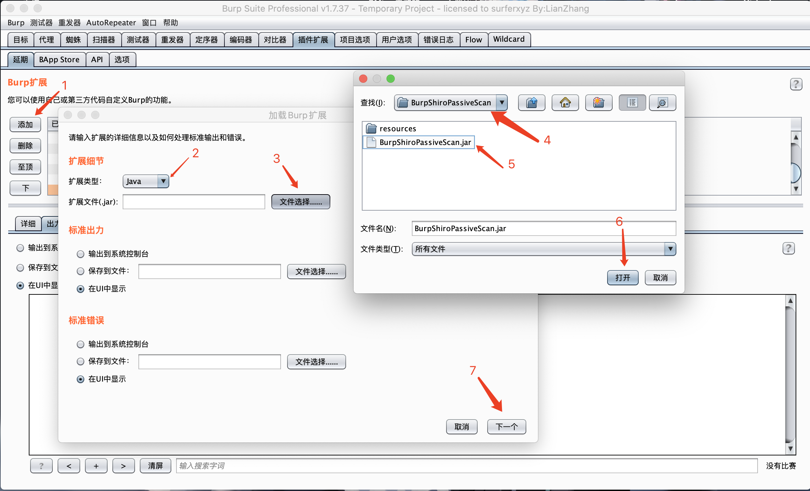
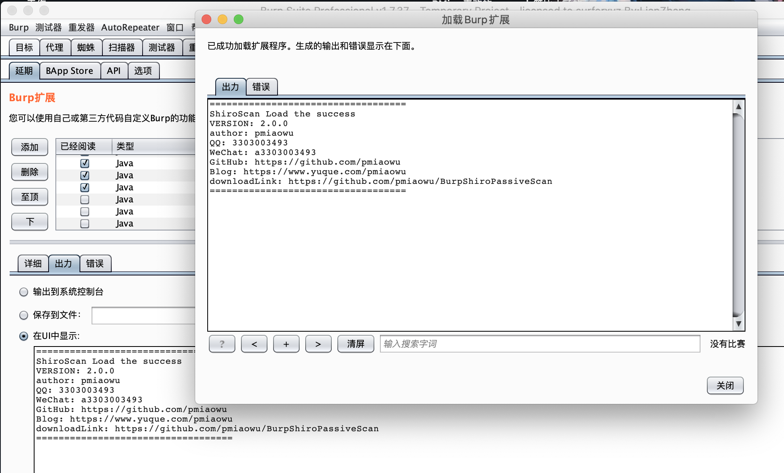
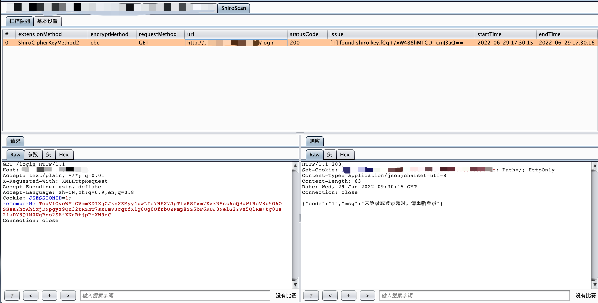
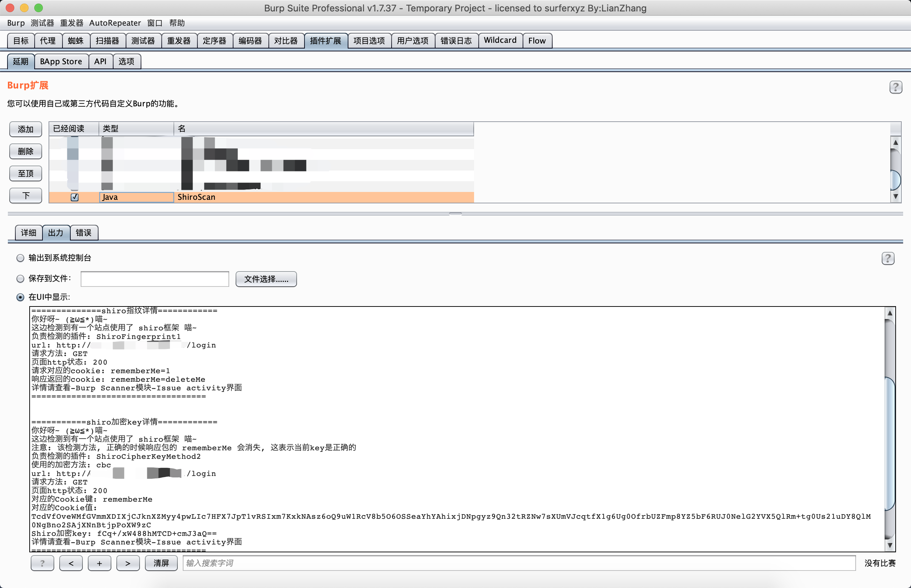
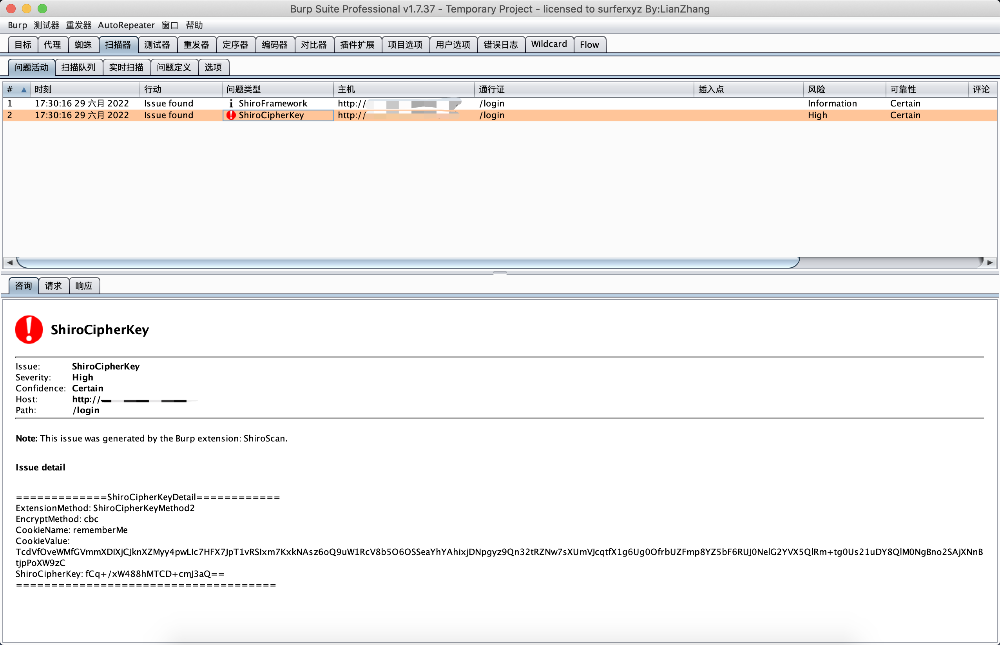

# BurpShiroPassiveScan
一款基于BurpSuite的被动式shiro检测插件

# 免责声明
该工具仅用于安全自查检测

由于传播、利用此工具所提供的信息而造成的任何直接或者间接的后果及损失，均由使用者本人负责，作者不为此承担任何责任。

本人拥有对此工具的修改和解释权。未经网络安全部门及相关部门允许，不得善自使用本工具进行任何攻击活动，不得以任何方式将其用于商业目的。

# 自言自语
据听说它的诞生是因为作者太太太懒了!

不想每个站点自己去添加个rememberMe去探测是否shiro框架

于是乎～

它就诞生了

# 简介
BurpShiroPassiveScan 一个希望能节省一些渗透时间好进行划水的扫描插件

该插件会对BurpSuite传进来的每个不同的域名+端口的流量进行一次shiro检测

目前的功能如下
- shiro框架指纹检测
- shiro加密key检测,cbc,gcm

# 请注意!!!!
下载完毕以后,请务必打开 /resources/config.yml 看看配置文件,里面有很多自定义的功能,可以自由选择, 例如添加shiro key功能

下载完毕以后,请务必打开 /resources/config.yml 看看配置文件,里面有很多自定义的功能,可以自由选择, 例如添加shiro key功能

下载完毕以后,请务必打开 /resources/config.yml 看看配置文件,里面有很多自定义的功能,可以自由选择, 例如添加shiro key功能

# 编译方法

<details>
<summary><b>编译方法</b></summary>

这是一个 java maven项目

导入idea,打开刚刚好下载好的源码



打开: /BurpShiroPassiveScan/pom.xml 安装对应的包,第一次安装依赖包需要比较久,慢慢等不要急





编译文件地址: ./BurpShiroPassiveScan/target/BurpShiroPassiveScan/

jar包地址: ./BurpShiroPassiveScan/target/BurpShiroPassiveScan/BurpShiroPassiveScan.jar

项目配置文件地址: ./BurpShiroPassiveScan/target/BurpShiroPassiveScan/resources/config.yml

接着拿着这个jar包, 导入BurpSuite即可

</details>

# 安装方法





# 检测方法选择

目前只有一种方法进行shiro框架的key检测

1. l1nk3r师傅的基于原生shiro框架 检测方法

l1nk3r师傅的检测思路地址: https://mp.weixin.qq.com/s/do88_4Td1CSeKLmFqhGCuQ

根据我的测试l1nk3r师傅的这个方法更加适合用来检测“shiro key”这个功能！！！

使用l1nk3r师傅这个方法对比URLDNS我认为有以下优点

1. 去掉了请求dnslog的时间, 提高了扫描速度, 减少了大量的额外请求
2. 避免了有的站点不能出网导致漏报
3. 生成的密文更短, 不容易被waf拦截

基于以上优点, 我决定了, 现在默认使用 l1nk3r师傅 这个方法进行 shiro key的爆破

# 使用方法
我们正常去访问网站, 如果站点的某个请求出现了,那么该插件就会去尝试检测

访问完毕以后, 插件就会自动去进行扫描

如果有结果那么插件就会在以下地方显示
- Tag
- Extender
- Scanner-Issue activity

# 问题查看
目前有这几个地方可以查看








# tag界面查看漏洞情况

```
现在可以通过tag界面查看漏洞情况了

分别会返回
- the number of website scans exceeded = 超出网站可扫描次数(可通过config.yml修改)
- shiro fingerprint problems have exceeded the number = shiro指纹问题已经超过了暴露次数(可通过config.yml修改)
- shiro encryption key leakage problems have exceeded the number = shiro加密密钥泄露问题已经超过了暴露次数(可通过config.yml修改)
- shiro fingerprint module startup error = shiro指纹模块启动错误
- the site is not a shiro framework = 这个网站不是shiro框架
- waiting for test results = 等待测试结果
- [-] not found shiro key = 没有找到shiro的key
- [+] found shiro key: xxxxx = 发现了shiro的key
- [*] shiro fingerprint = 表示使用了shiro框架
- [x] unknown error = 未知错误
```

# 新增key的方法
```
嫌弃内置key不够多,可以这样

打开: ./BurpShiroPassiveScan/resources/config.yml
找到: application.shiroCipherKeyExtension.config.payloads

然后在后面添加新key即可

注: 修改了配置,记得重新加载插件,这样才会生效
```

# 设置多线程的方法
```
嫌弃跑的慢,可以这样

打开: ./BurpShiroPassiveScan/resources/config.yml
找到: application.shiroCipherKeyExtension.config.threadTotal

然后修改想开的线程即可,默认为4线程

注: 修改了配置,记得重新加载插件,这样才会生效
```